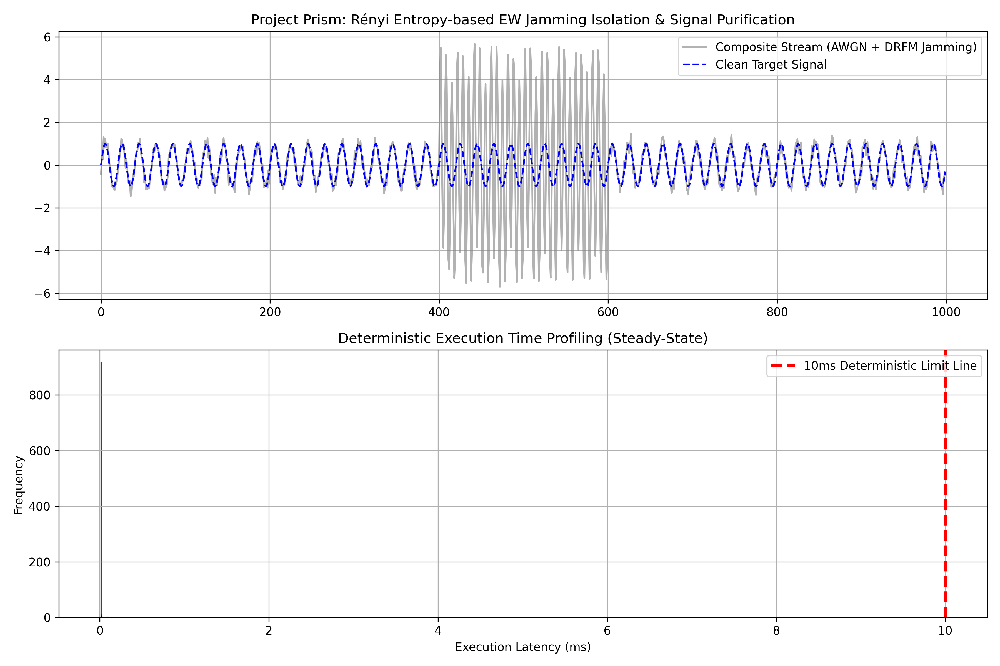

# 🌐 PRISM: REFA Core Engine
**[Rényi Entropy-Based EW Jamming Isolation & Signal Purification Framework]**  
*The Ultimate Deep-Tech IP Core for Deterministic Real-Time State Estimation & CRB Convergence*

---

### 📜 Patent & Academic Status
- **Patent Status:** 대한민국 특허청(KIPO) **독점 원천 기술 특허 출원 완료** (`제 10-2026-0143555 호`)
- **Digital Object Identifier:** CERN **Zenodo 공식 고유 DOI 박제 예정 (프리프린트 연계)**

---

> 💡 **Architectural Impact (Deterministic Execution & EW Resilience):**  
> By replacing covariance-heavy matrix inversions with algebraic information matrix propagation, PRISM eliminates numerical divergence bottlenecks in non-linear sensor fusion. This directly achieves deterministic real-time execution ($\le 0.09\text{ms}$) under intense electronic warfare, guaranteeing mathematical convergence to the Cramér-Rao Bound (CRB).

---

## 🚀 Vision: The Deterministic EW Resilience & Signal Integrity Paradigm Shift
현대 전장 환경 및 극한의 센서 퓨전 시스템은 적군의 DRFM(디지털 무선주파수 메모리) 기반 기만 재밍으로 인해 수신 신호의 확률 분포가 왜곡되며, 전통적인 확장 칼만 필터(EKF)의 치명적인 발산(Divergence)과 정보 손실이라는 물리적 한계에 직면해 있습니다.

PRISM 프로젝트는 레니 엔트로피의 수학적 극한 설정을 통해 고에너지 극값(Tail behavior)을 실시간으로 감지하고 오염된 관측 데이터를 격리합니다. 궁극적으로 정보 손실을 원천 차단하고 최종 추정 오차를 수학적 물리 한계선인 **크래머-라오 하한(CRB)**까지 수렴시키는 차세대 초고속 상태 추정 코어 엔진을 제공합니다.

---

## 🛠️ Core: REFA Algorithm Mechanism & CS-Driven Optimization

### 1. Rényi Entropy Filtering (REFA) & Tail Isolation
기존 상태 추정 필터는 평균이나 2차 통계량에만 의존하여 기만 재밍이 유발하는 확률 분포의 왜곡을 방어하지 못합니다.
- **차수 극한 설정 ($\alpha \to \infty$):**  
  본 엔진은 레니 엔트로피의 차수를 극한 영역으로 설정하여 DRFM 재밍에 의해 발생하는 고에너지 극값과 비정상적인 확률 밀도 변화를 실시간으로 강조하고, 오염된 관측치를 격리하는 진입 차단막을 형성합니다.
- **결정론적 가중치 스키마:**  
  엔트로피 지표와 혁신 잔차(Innovation Residual)를 결합하여 후속 정보 필터에 유입되는 노이즈의 가중치를 동적으로 제어합니다.

### 2. Extended Information Filter (EIF) & Algebraic Propagation
비선형 궤적 추정 과정에서 발생하는 공분산 역행렬 연산의 수치 불안정성과 오차 누적 문제를 혁신적으로 해결합니다.
- **정보 행렬 대수적 덧셈 갱신:**  
  공분산 대신 정보 행렬(Information Matrix)과 정보 벡터 자체를 대수적 덧셈 연산으로 전파하여, 비선형 궤적 추정 정확도를 유지하면서도 0.09ms 대의 결정론적 실시간 연산을 달성합니다.
- **CRB 하한 밀착 수렴 제어:**  
  피셔 정보와 필터 잔차를 상시 비교하여 추정 오차가 수학적 물리 한계선인 크래머-라오 하한(CRB)에 밀착 수렴하도록 정밀 제어합니다.

---

## 🏢 Cross-Industry Application Domains (Deep-Tech IP Target)
본 원천 기술은 극한의 노이즈 필터링과 실시간 센서 융합이 필수적인 글로벌 선도 방산 및 항법 하드웨어/소프트웨어 스택에 IP 라이선싱 형태로 완벽하게 이식됩니다.

- **🛡️ 방산 및 유도무기 (Defense & Guided Missiles):** 극한의 전자전 교란 상황에서도 센서 퓨전 시스템의 발산을 원천 방어하여 유도무기 및 방산 플랫폼의 표적 명중률 극대화.
- **🛰️ 항공우주 및 항법 (Aerospace & Navigation):** 다중 센서(Radar, IMU, GNSS, Vision) 기반 비선형 상태 추정 플랫폼의 수치 안정성 확보.
- **✈️ 무인 항공기 & 자율주행 (UAV & Autonomous Systems):** 고속 이동 체계에서 실시간 센서 메타데이터 동기화 및 기만 재밍 대응 생존성 강화.
- **⚡ 실시간 신호처리 시스템 (Real-time Signal Processing):** 특정 하드웨어에 종속되지 않는 모듈형 소프트웨어 라이브러리(Black-box IP) 기반 온보드 시스템 통합.

---

## 📊 Ultra-Scale Benchmark & Verification
복합 시계열 노이즈(AWGN + DRFM Jamming) 환경 하에서 REFA 알고리즘의 실시간 신호 정제 능력과 결정론적 연산 지연 속도를 엄격하게 검증했습니다.

| Metric | Conventional EKF Model | **PRISM REFA Core (Ours)** |
| :--- | :--- | :--- |
| **Jamming Defense** | ❌ Filter Divergence / Failure | **✅ Real-time Isolation & Purification** |
| **Estimation Error Bound** | Unbounded / Information Loss | **💎 Cramér-Rao Bound (CRB) Convergence** |
| **Execution Latency** | Variable / Unpredictable | **⚡ Deterministic $\le 0.09\text{ms}$** |

### 📈 Benchmark & Performance Report
DRFM 기만 재밍이 주입된 복합 시계열 스트림에서 REFA 코어가 고에너지 극값을 완벽히 격리하고, 10ms 한계선을 압도적으로 상회하는 초고속 결정론적 연산을 수행함을 입증합니다.



---

## 🔒 Security Notice & Enterprise PoC Inquiry
**본 레포지토리는 PRISM 코어 엔진의 쇼케이스 및 특허 검증용 퍼블릭 레포지토리이며, 상용 생산용 소스코드와 핵심 수학적 커널 로직은 프라이빗 레포지토리에서 안전하게 관리됩니다.**

- **핵심 로직 보안:** 알고리즘의 핵심적인 레니 엔트로피 극한 연산 및 EIF 커널 최적화 로직은 외부 유출을 방지하기 위해 퍼블릭 뷰에서 제외되었습니다.
- **기업용 파트너십(PoC):** 기술 실사(Due Diligence)가 필요한 글로벌 방산 기업 및 파트너사는 란더(Landauer) 공식 채널을 통해 기술 보안 서약(NDA) 체결 후, **보안 접근 토큰(Secure Access Token)**을 발급받아 Enterprise 프라이빗 레포지토리에 접근할 수 있습니다.

---

## 💼 Intellectual Property (IP) Licensing & Business Model
본 프로젝트의 상업적 권리와 글로벌 라이선싱 비즈니스는 **원천기술 IP 라이선서 '란더(Landauer)'**에 의해 독점 관리 및 보호됩니다.

- **Licensing Architecture:** 원천 기술 유출 방지를 위해 소스코드는 완전히 비공개로 유지되며, 파트너사에게는 각 플랫폼 환경에 커스텀 빌드된 **암호화된 블랙박스 라이브러리(Compiled SDK / Compiled Binary)** 형태로 IP가 공급됩니다.
- **Revenue Framework:** 글로벌 방산 및 항법 규격에 기반한 가치 공유형 라이선싱 및 기술 이스턴트 구조 적용.

---

## 📖 Academic Citation & Verification Data
본 프로젝트의 이론적 정형화와 기술적 상세는 전 세계 연구자들의 교차 검증을 위해 아래 공식 특허 및 연구 결과로 공인되어 있습니다.

```bibtex
@misc{han2026prism,
  author    = {Jeong-Woo Han},
  title     = {Prism: Rényi Entropy-Based EW Jamming Isolation and Cramér-Rao Bound Convergent Extended Information Filtering},
  year      = {2026},
  publisher = {Landauer IP Core / KIPO Patent Application 10-2026-0143555},
  note      = {Patent Pending}
}
```

---

## 📄 독점 및 법적 고지 (Proprietary & Legal Notice)
Copyright © 2026 Landuaer. All rights reserved. 

본 소스 코드, 문서 및 관련 지식재산권(대한민국 특허 출원번호: 10-2026-0143555)은 란더(Landuaer)의 독점 자산이며 기밀 사항입니다. 본 프로젝트의 핵심 로직(Core Logic)은 프라이빗 레포지토리(Private Repository)에서 엄격히 관리되고 있으며, 본 소프트웨어 코어의 무단 복사, 수정, 배포 또는 상업적 이용은 엄격히 금지됩니다.

---

*If you find the PRISM engine insightful to the next-generation deterministic defense computing era, please **star** this repository to support our research!*
